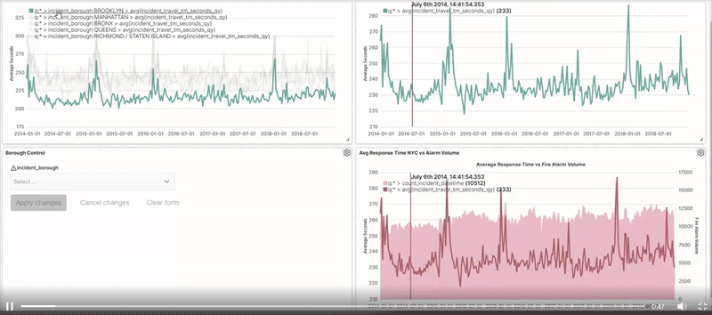

## Portfolio

---

### ETL - Data Pipelines

[How fast are NYC firefighters?](/FireDispatch)

I automated workflow to extract data from NYC Fire dispatch, clean and visualize with ELK Stack.
Turned out crazy traffic in Manhattan doesn't stop it from being the 2nd quickest borough to response to fire alarm!

*This project streams data directly into OpenSearch cluster provisioned via AWS and analyzez NYC fire alarms between 2012 and 2021. This project is applied with the knowledge of principles of containerization, terminal navigation, python scripting, artifact deployment and AWS EC2 provisioning.*

---
[Project 2 Title](/pdf/sample_presentation.pdf)

---
[Project 3 Title](http://example.com/)

---

### Category Name 2

- [Project 1 Title](http://example.com/)
- [Project 2 Title](http://example.com/)
- [Project 3 Title](http://example.com/)
- [Project 4 Title](http://example.com/)
- [Project 5 Title](http://example.com/)

---

---

Page template forked from <a href="https://github.com/evanca/quick-portfolio">evanca</a>

<!-- Remove above link if you don't want to attibute -->
